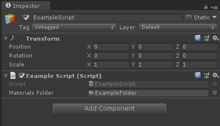

# FolderAttribute

And NOW you can reference folders into Unity's Inspector.

That's what I've been waiting for years, until I decided to code it myself! Enjoy :D

## Getting Started

For a quick import into an existing project, just get the [UnityPackage](FolderAttributePackage.unitypackage).

The FolderAttribute folder is an empty project with only the plugin imported and some examples! :)

See the [Code Usage](#code-usage) for details on how to use it in your project.

## Code Usage

```csharp
using Folder; // Don't forget this.

[Folder]
public string materialsFolder; // A variable with [Folder] must be a string.

void Start()
{
    // Get the content of the folder!
    Material[] materials = materialsFolder.LoadFolder<Material>();
}
```

## Screenshots



## Notes

* Last tested with [Unity 2019.1.0f2](https://unity3d.com/unity/whatsnew/unity-2019.1.0) from 15 April 2019.

## Authors

* Special thanks to **[Jérémy Chopin](https://www.linkedin.com/in/jeremy-chopin/)**
* **[Arthur Cousseau](https://www.linkedin.com/in/arthurcousseau)**

## License

This project is licensed under the MIT License - see the [LICENSE.md](LICENSE.md) file for details

## Going further...

We could do many things on top of this.

For example:

- Use the GUID of the folder in addition to its path, to keep track of the folder even if it's renamed or moved elsewhere.
